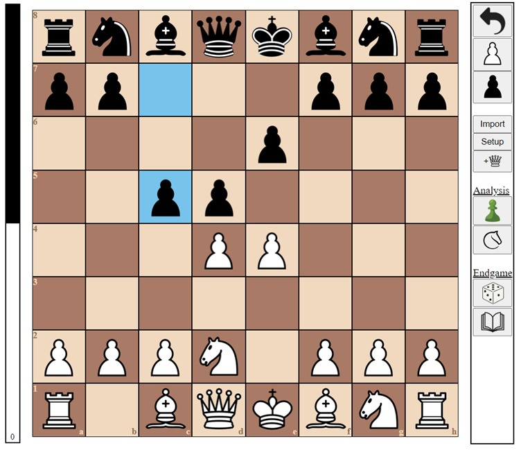

# Wil's Chess Engine

### ./java_chess 

A chess GUI and handmade engine written in Javascript which utilises advanced search strategies such as bitboard board representation and minimax search with alpha beta pruning. The AI makes use of a small openings book to ensure the same game doesn't get repeated every time.

Interacts with the [Lichess API](https://lichess.org/api) to load the game into their computer analysis tool.

Currently working on incorporating Stockfish evaluation and endgame tablebase lookup for a more accurate AI to practice puzzles and strategies against. 

### ./c_chess

A conversion of the java_chess engine to c++ to compare the performance gains in a programming language that supports 64-bit integers (ideal for bitboard board representation).

### Robotic Chess Board

I am creating a physical chess board to allow my ./c_chess AI to be battled on a real board. The pieces will be moved by a magnet underneath the board, operated by 2 stepper motors. Path plotting code is required so pieces being moved don't collide with other pieces on the board and can be found in the ./c_chess directory.

I have developed chess pieces using a 3D printer which will eventually contain a RFID chip to identify the piece and a marget to move it around. The next step of this project is to create the physical board containing readers on each of the 64 squares so the engine can be loaded from any position.   

